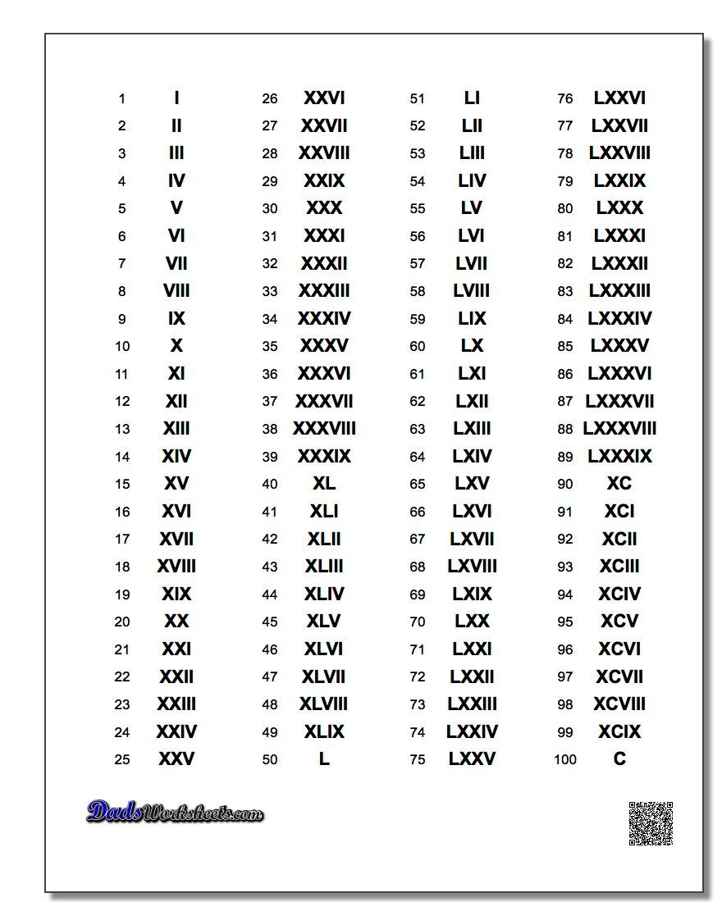

# Roman Numerals Paired Programming

The utility class converts from Roman numeral `i` into `1`.

Update the utility class to convert numbers 1 to 10 as simply as possible. Once at 10 refactor the code.

* The solution has to be developed following a TDD approach (fail then pass).
* The solution should be refactored only when tests are in place.

## Conversion Chart

